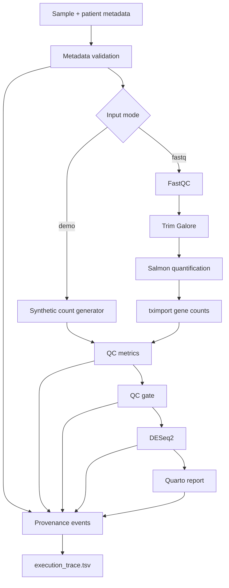

# PRISM-Flow Demo
[](https://github.com/mahdibiotech/prism-flow-demo/actions/workflows/ci.yml)
**A reproducible multi-omics-ready processing and provenance framework for translational bioinformatics.**

> **Independent portfolio project.** This repository is not an official Gustave Roussy or IHU PRISM software product and contains no patient data. It was built as a technical demonstrator for a Junior Bioinformatics Engineer application.

## Why this project exists

Clinical bioinformatics platforms have to do more than run tools: they must validate metadata, automate processing, apply QC rules, record provenance, support HPC execution, version environments, and deliver interpretable results reproducibly.

PRISM-Flow demonstrates that engineering layer with a concrete bulk RNA-seq implementation and an architecture designed to be extended to additional modalities such as single-cell, spatial transcriptomics and variant workflows.

### Demonstrated capabilities

- **Workflow orchestration:** Snakemake
- **Bulk RNA-seq production path:** FastQC → Trim Galore → Salmon → tximport → DESeq2
- **Runnable lightweight demo:** synthetic count matrix → QC gate → DESeq2
- **Metadata validation:** schema-like checks before processing
- **Quality management:** explicit PASS/WARN/FAIL QC gate
- **Provenance:** per-rule JSON events + aggregated `execution_trace.tsv`
- **Reproducibility:** pinned Conda environments, Git commit capture, config-driven execution
- **Reporting:** Quarto HTML report
- **HPC:** SLURM profile template
- **Software quality:** tests, CI, structured logs and benchmarks

## Architecture



## Repository layout

```text
prism-flow-demo/
├── config/
│   ├── config.yaml
│   ├── patients.tsv
│   ├── samples.tsv
│   └── samples_fastq.template.tsv
├── workflow/
│   ├── Snakefile
│   ├── envs/
│   ├── profiles/slurm/
│   ├── report/report.qmd
│   └── rules/
├── scripts/
├── tests/
├── docs/
├── containers/
└── .github/workflows/
```

## Quick start — demo mode

Requirements: `conda`/`mamba` and Snakemake >= 8.

```bash
conda env create -f environment.yml
conda activate prism-flow
snakemake --snakefile workflow/Snakefile --cores 2 --use-conda
```

Expected final outputs:

```text
results/
├── metadata/validation.json
├── bulk/counts/gene_counts.tsv
├── qc/sample_qc.tsv
├── qc/qc_gate.tsv
├── bulk/deseq2/results_full.tsv
├── bulk/deseq2/results_significant.tsv
├── bulk/deseq2/normalized_counts.tsv
├── bulk/deseq2/pca.png
├── bulk/deseq2/volcano.png
└── report/prism_flow_report.html

provenance/execution_trace.tsv
```

The demo uses **synthetic data only**. It creates a small balanced cohort with a known simulated expression signal so the workflow can be tested end-to-end without protected data or large FASTQ files.

## Production FASTQ mode

1. Copy the template sample sheet:

```bash
cp config/samples_fastq.template.tsv config/samples_fastq.tsv
```

2. Add real file paths and edit `config/config.yaml`:

```yaml
input:
  mode: fastq
  samples: config/samples_fastq.tsv

reference:
  salmon_index: /path/to/salmon_index
  tx2gene: /path/to/tx2gene.tsv
```

3. Run:

```bash
snakemake --snakefile workflow/Snakefile --cores 8 --use-conda
```

For cluster execution, adapt `workflow/profiles/slurm/config.yaml` to the local HPC scheduler configuration.

## Metadata contract

Required sample columns:

| Column | Meaning |
|---|---|
| `sample_id` | Unique technical sample identifier |
| `patient_id` | Patient/pseudonym identifier |
| `condition` | Analysis group, e.g. `tumor` / `normal` |
| `modality` | Controlled vocabulary; here `bulk_rnaseq` |
| `sample_type` | Biological material description |
| `fastq_r1` | R1 path in FASTQ mode |
| `fastq_r2` | R2 path in paired FASTQ mode |

Validation rejects duplicate sample IDs, unknown modalities, missing conditions, broken patient references, and missing FASTQ paths in `fastq` mode.

## QC model

The demo computes per-sample count-level metrics:

- total library size;
- number of detected genes;
- zero-count fraction.

Thresholds are configuration-driven. Each sample receives:

- `PASS` — all quality criteria met;
- `WARN` — one criterion outside preferred range;
- `FAIL` — critical minimum not met.

In a production implementation these gates can be extended with mapping rate, duplication, insert-size, contamination, rRNA fraction, gene-body coverage and modality-specific metrics.

## Provenance model

Each major rule writes an event record containing:

```text
rule
sample
step
status
started_at
finished_at
runtime_seconds
inputs
outputs
command
software_environment
git_commit
```

Events are aggregated into `provenance/execution_trace.tsv`. The intent is to make every result traceable back to configuration, software and input artifacts.

## Design choices

### Why Snakemake?

It provides explicit dependencies, incremental recomputation, Conda/container integration, resource declarations and HPC support while keeping the workflow readable to research bioinformatics teams.

### Why both demo and FASTQ modes?

A reviewer should be able to clone and exercise the engineering logic quickly. The production branch demonstrates real sequencing-tool integration, while demo mode keeps CI and evaluation lightweight.

### Why metadata validation before computation?

Silent metadata errors can invalidate downstream statistics. Failing early is cheaper and safer than discovering inconsistencies after compute-intensive processing.

## Extending to multi-omics

The current repository implements bulk RNA-seq as the fully coded reference modality. The intended extension pattern is:

```text
workflow/rules/
├── bulk_rnaseq.smk
├── single_cell.smk      # future
├── spatial.smk          # future
└── variants.smk         # future
```

All modalities should converge on the same platform contracts: validated metadata, QC state, provenance event, versioned result directory and reportable summary.

## Tests

```bash
python -m unittest discover -s tests -v
```

## Reproducibility notes

- Never commit patient identifiers or protected clinical data.
- Use pseudonymised IDs and institution-approved storage.
- Pin reference genome/annotation versions.
- Prefer immutable containers for validated production releases.
- Record Git commit and workflow configuration with every run.
- Separate research-use reports from clinical decision-support software validation.

## Author note

This project is intentionally compact. Its goal is not to claim clinical validation or reproduce an institutional platform, but to demonstrate how I structure reproducible bioinformatics processing, quality control, metadata validation and traceability around omics workflows.
